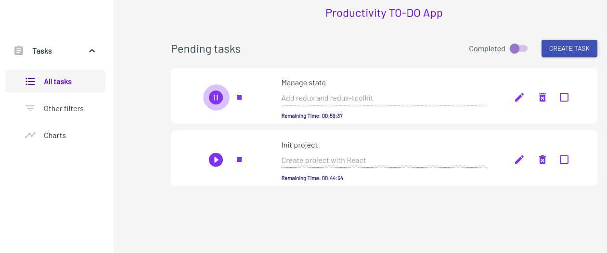

# Productivity TODO App

## Fork the project

- Clone the project: [Productivity TODO App](https://github.com/lemmusm/todo-list-arkon)
- Install dependencies `npm install`
- Run the project `npm start`

## Deployment

- Netlify: [Productivity TODO App](https://musing-euclid-72c2f3.netlify.app/)

## Built with

- ReactJS
  - react-redux
  - reduxjs/toolkit
  - react-router-dom
  - react-hook-form
- MaterialUI

## Author

- Website - [lemmusm.netlify.app](https://lemmusm.netlify.app/)
- Twitter - [@lemmusm](https://www.twitter.com/lemmusm)
